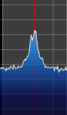
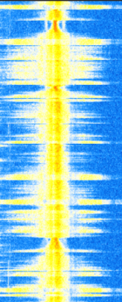
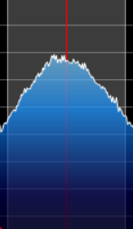
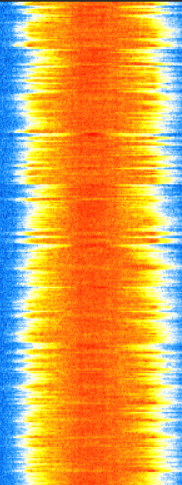
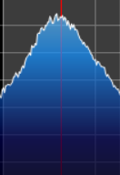
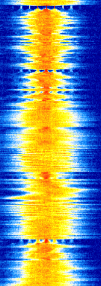
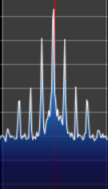
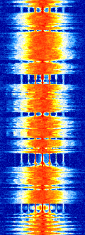
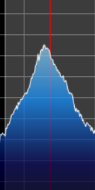
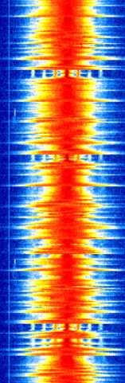

# 3. FM Broadcast Analysis with SDRSharp

The first experimental stage was performed using SDRSharp. Several FM broadcast stations in the Bursa region were observed and compared in terms of spectrum shape, signal strength, and waterfall behavior.

## 3.1 Observation of FM broadcasts

SDRSharp was used to tune into different FM broadcast frequencies. For each station, the spectrum and waterfall views were inspected. These observations helped identify which station had the strongest and most stable signal for later GNU Radio experiments.

## 3.2 Spectrum and waterfall analysis

Five FM stations were examined. The comparison showed that signal quality can vary significantly depending on transmitter power, location, propagation conditions, antenna placement, and receiver gain settings.

## 3.2.1 Station 1 - PAL FM (87.7 MHz)

PAL FM was observed as one of the weaker signals among the tested stations. Its spectrum peak could still be identified, but it was closer to the noise floor compared to stronger stations.

## 3.2.2 Station 2 - Radyo Karadeniz (88.6 MHz)

Radyo Karadeniz produced a stronger signal than PAL FM. The spectrum was more visible and the waterfall display showed a clearer continuous broadcast structure.

## 3.2.3 Station 3 - Metro FM (97.2 MHz)

Metro FM was observed as a medium-strength FM broadcast. The energy distribution around the center frequency showed a typical wideband FM broadcast characteristic.

## 3.2.4 Station 4 - A Spor Radyo (96.4 MHz)

A Spor Radyo produced a strong and stable received signal. In the waterfall display, the broadcast could be followed continuously and clearly.

## 3.2.5 Station 5 - MAX FM (95.8 MHz)

MAX FM was one of the strongest received stations in the experiment. Because of its stable and strong signal level, it was selected as the reference station for the later GNU Radio FM demodulation and RDS decoding experiments.

## 3.3 Initial observations

The five observed FM broadcasts showed different signal levels and waterfall characteristics. Weak signals had spectrum peaks closer to the noise floor and less clear waterfall patterns. Stronger broadcasts produced more stable and continuous waterfall traces.

All stations showed the expected wideband FM broadcast behavior. The received signals occupied a bandwidth on the order of 200 kHz, which is consistent with commercial FM broadcasting. The signals also appeared approximately symmetric around their center frequencies.

Based on these observations, MAX FM at **95.8 MHz** was selected as the reference station for the remaining FM demodulation, RDS decoding, and baseband structure analysis sections.
