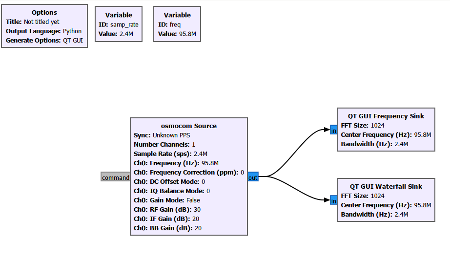
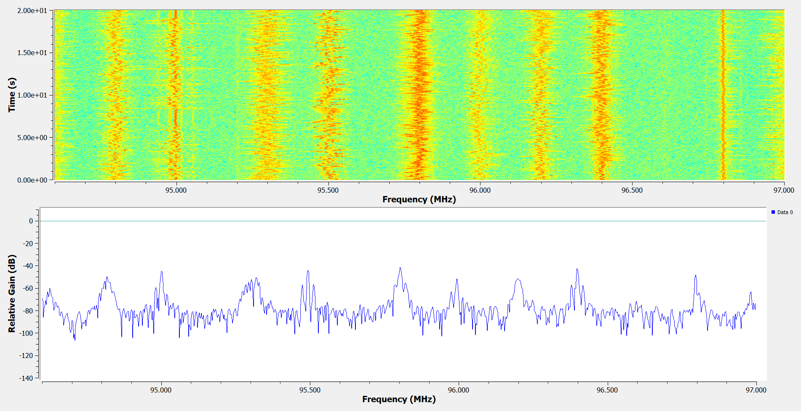
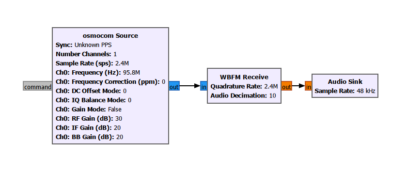
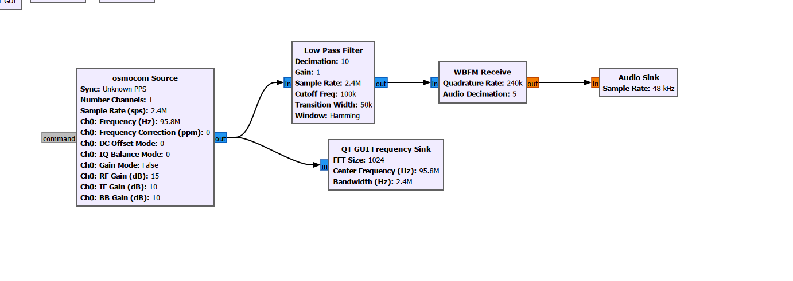
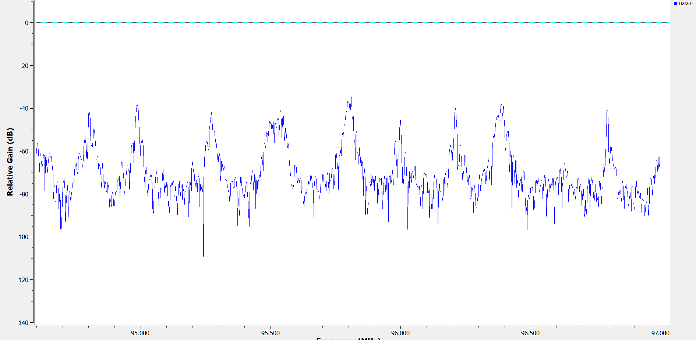
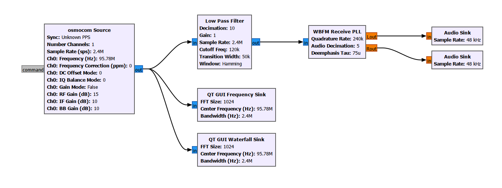
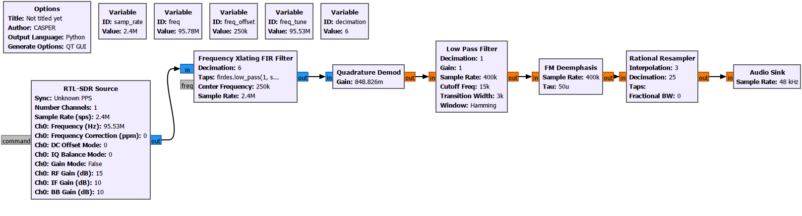

# 4. FM Analysis with GNU Radio

After the initial SDRSharp observations, the FM broadcast signal was received and analyzed in GNU Radio. The MAX FM broadcast around 95.8 MHz was selected as the reference signal because it was one of the strongest and most stable stations observed in SDRSharp.

## 4.1 RTL-SDR source configuration

The first GNU Radio flowgraph used the RTL-SDR Source block to receive IQ samples from the SDR receiver. The received signal was inspected using frequency and waterfall display blocks.





These observations confirmed the SDRSharp results. The MAX FM signal was clearly visible and suitable for demodulation experiments.

## 4.2 Built-in WBFM receiver block

GNU Radio includes a built-in **WBFM Receive** block for wideband FM demodulation. In the first implementation, the RTL-SDR Source output was connected to the WBFM Receive block and then to the Audio Sink.



The FM broadcast could be demodulated and audio was obtained successfully. However, the audio contained noticeable noise and crackling in the first attempts.

The main reason was that the RTL-SDR was receiving a relatively wide IQ bandwidth, while the target FM station occupied only a part of that spectrum. When the entire received bandwidth was passed directly into the demodulator, neighboring stations and noise components could also affect the audio quality.

## 4.2.1 Filtering and sample-rate reduction

To improve the audio quality, filtering was added to the receiver chain. A low-pass filter was used after FM demodulation to suppress high-frequency noise components outside the useful audio band.

Commercial FM audio typically carries the main audio information up to approximately 15 kHz. Therefore, filtering the output helped preserve the useful audio signal while reducing high-frequency noise.





## 4.2.2 Audio quality improvement

Several receiver parameters were adjusted systematically:

- Filter cutoff frequency
- Transition bandwidth
- RF gain
- IF gain
- BB gain
- Center frequency correction
- De-emphasis time constant

The best result was obtained using approximately:

- Cutoff frequency: **120 kHz**
- Transition bandwidth: **50 kHz**
- RF gain: **15 dB**
- IF gain: **10 dB**
- BB gain: **10 dB**
- Tuned frequency: approximately **95.78 MHz**
- De-emphasis: **75 us**

After these adjustments, the audio became cleaner and the high-frequency crackling was reduced.



## 4.3 Custom FM demodulator implementation

After testing the built-in WBFM Receive block, a custom FM receiver chain was built using lower-level GNU Radio blocks. The goal was to understand the demodulation process more clearly and to gain more control over each stage of the receiver.

The custom receiver chain was:

```text
RTL-SDR Source -> Frequency Xlating FIR Filter -> Quadrature Demod -> Low Pass Filter -> FM Deemphasis -> Rational Resampler -> Audio Sink
```

### Frequency Xlating FIR Filter

The Frequency Xlating FIR Filter is one of the most important blocks in the custom receiver.

It performs three tasks at the same time:

1. **Frequency translation**  
   The desired FM station is digitally shifted to baseband.

2. **Channel filtering**  
   Frequencies outside the selected FM channel are suppressed.

3. **Decimation**  
   The sampling rate is reduced from 2.4 MHz to 400 kHz, decreasing the computational load of the following blocks.

This structure also helps avoid problems caused by the DC spike and IQ imbalance that may appear at the direct center frequency of RTL-SDR receivers.

### Quadrature Demod

The Quadrature Demod block performs the main FM demodulation operation.

In FM, the message is not carried in the amplitude of the signal. Instead, the information is carried by changes in instantaneous frequency. The Quadrature Demod block estimates the phase difference between consecutive IQ samples and converts this phase change into a frequency deviation signal.

The gain value was selected using:

```text
Gain = Fs / (2*pi*Delta_f)
```

where:

```text
Fs = 400 kHz
Delta_f = 75 kHz
```

After this stage, the RF carrier information is removed and a baseband signal containing the audio information is obtained.

### Low Pass Filter

The demodulated signal still contains high-frequency components and noise. A Low Pass Filter was used to suppress unnecessary components above the useful audio range.

This helped reduce:

- High-frequency noise
- Demodulation artifacts
- Unwanted components outside the audio band

### FM Deemphasis

FM broadcast systems apply **pre-emphasis** at the transmitter side. This increases high-frequency audio components before transmission to improve the signal-to-noise ratio against high-frequency noise.

At the receiver side, the inverse operation must be applied. The FM Deemphasis block was used for this purpose. A **75 us** time constant was used, which reduced high-frequency harshness and produced more natural audio.

### Rational Resampler

After demodulation and filtering, the sample rate was still not directly compatible with the audio output. The Rational Resampler converted the sample rate from **400 kHz** to **48 kHz** so that the signal could be sent to the Audio Sink.



## 4.4 Results

A working FM receiver was successfully implemented without relying only on the built-in WBFM Receive block. Each block in the custom receiver chain was examined separately, making the FM demodulation process more understandable.

The custom receiver produced audio quality close to the built-in WBFM receiver. In some parameter settings, it even produced a cleaner sound because the filtering, gain, and resampling stages could be controlled more directly.

This part of the project was especially useful for understanding how FM demodulation is implemented at block level in SDR systems.
