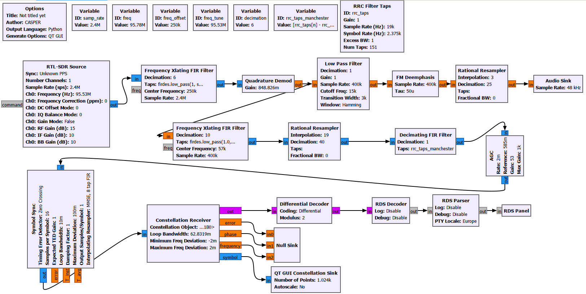
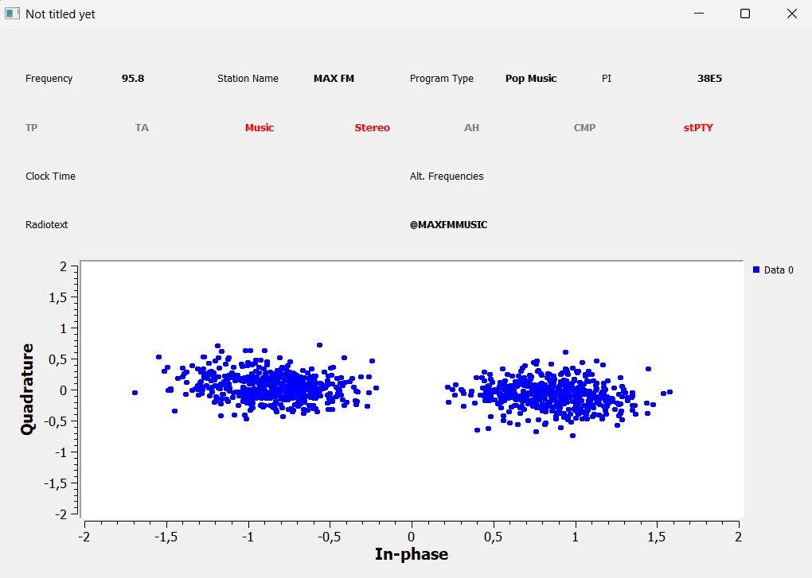

# 5. FM Demodulation and RDS Decoding

FM broadcast signals can carry not only audio, but also digital data. One common digital service is **RDS (Radio Data System)**. RDS is transmitted on a 57 kHz subcarrier inside the FM composite baseband signal.

In this section, a GNU Radio based RDS receiver was implemented. The goal was to extract the 57 kHz RDS subcarrier, process it as a digital communication signal, and decode useful information such as station name, program type, PI code, and radiotext.



## 5.1 RDS receiver system

The RDS receiver first demodulates the FM broadcast signal and obtains the composite baseband signal. This composite signal contains several components:

```text
0-15 kHz   : L+R mono audio
19 kHz     : stereo pilot tone
38 kHz     : stereo difference information
57 kHz     : RDS subcarrier
```

The 57 kHz component is then isolated, shifted to baseband, filtered, synchronized, and decoded.

## 5.2 Blocks used in the RDS receiver

### RTL-SDR Source

The RTL-SDR Source block receives IQ samples from the RTL-SDR receiver and sends them into the GNU Radio flowgraph.

The output of this block is a complex baseband signal:

```text
I(t) + jQ(t)
```

### Frequency Xlating FIR Filter - FM channel selection

This block selects the desired FM station and shifts it to baseband.

It performs:

- Frequency translation
- Channel filtering
- Decimation

The sampling rate was reduced from:

```text
2.4 MHz -> 400 kHz
```

This reduces the computational load of the later stages.

### Quadrature Demod

The Quadrature Demod block performs FM demodulation. It calculates the phase difference between consecutive IQ samples and converts frequency variations into a baseband signal.

The gain was selected using:

```text
Gain = Fs / (2*pi*Delta_f)
```

where:

```text
Fs = 400 kHz
Delta_f = 75 kHz
```

The output of this stage is the FM composite baseband signal containing mono audio, stereo information, pilot tone, and RDS data.

### Frequency Xlating FIR Filter - RDS extraction

After FM demodulation, another Frequency Xlating FIR Filter was used to isolate the RDS component around **57 kHz**.

This block shifts:

```text
57 kHz -> 0 Hz
```

and reduces the sampling rate from:

```text
400 kHz -> 40 kHz
```

Only the RDS signal remains after this stage.

### Rational Resampler

The Rational Resampler changes the sample rate to a value suitable for the digital decoding chain. In this setup, the interpolation and decimation values were:

```text
Interpolation = 19
Decimation = 40
```

The resulting sample rate was approximately **190 kHz**.

### Decimating FIR Filter

This filter prepares the RDS signal for symbol processing. It uses filter coefficients suitable for the Manchester-coded RDS data.

Its tasks are:

- Reducing noise
- Making symbol transitions more visible
- Preparing the signal for timing recovery

### AGC - Automatic Gain Control

The AGC block automatically adjusts the signal amplitude. If the received signal is too weak, it increases the gain. If the signal is too strong, it reduces the gain.

This helps the following decision blocks operate more reliably.

### Symbol Sync

The Symbol Sync block finds the correct symbol timing. Since the RDS signal arrives as a continuous stream of samples, the receiver must determine the best sampling instant for each symbol.

This block:

- Finds symbol boundaries
- Selects the best sampling point
- Corrects timing errors

### Constellation Receiver

The Constellation Receiver makes symbol decisions. RDS uses a BPSK-like structure, so the constellation contains two main decision regions.

The receiver maps the symbols approximately as:

```text
+1 -> logical 1
-1 -> logical 0
```

A two-cluster constellation indicates that the RDS signal was being decoded successfully.

### Differential Decoder

RDS uses differential encoding. The Differential Decoder converts phase changes back into the actual bit stream.

### RDS Decoder

The RDS Decoder converts the bit stream into RDS packets. It performs:

- Synchronization
- Error checking
- Packet validation

### RDS Parser

The RDS Parser converts decoded RDS packets into meaningful information such as:

- Station name
- Program type
- PI code
- Radiotext
- Alternative frequencies

### RDS Panel

The RDS Panel displays the decoded information visually.

In this experiment, the following information was obtained successfully:

```text
Station Name : MAX FM
Program Type : Pop Music
PI Code      : 38E5
Radiotext    : @MAXFMMUSIC
```

## 5.3 Results

The RDS subcarrier at 57 kHz was successfully extracted from the FM composite baseband signal. After filtering, synchronization, constellation decision, differential decoding, and RDS packet parsing, station information was decoded successfully.



The two-cluster constellation structure confirmed that the RDS signal was being processed as a digital BPSK-type signal. The successful decoding of station name, program type, PI code, and radiotext verified that the 57 kHz component was correctly extracted and decoded.
