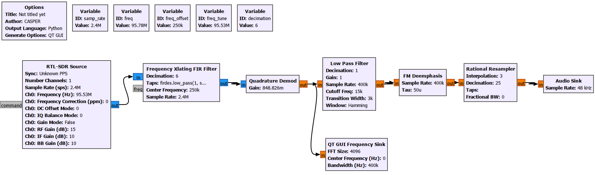
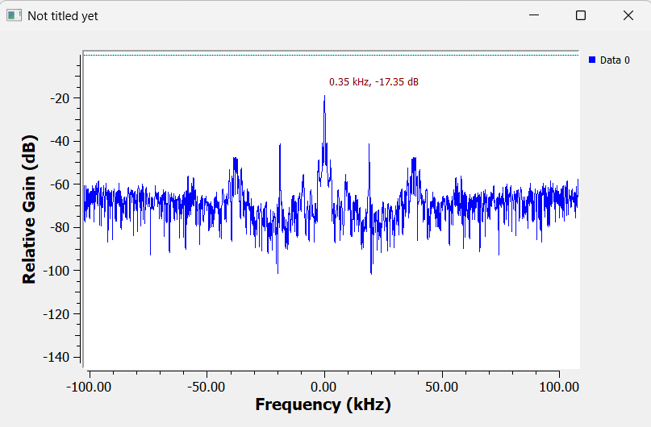
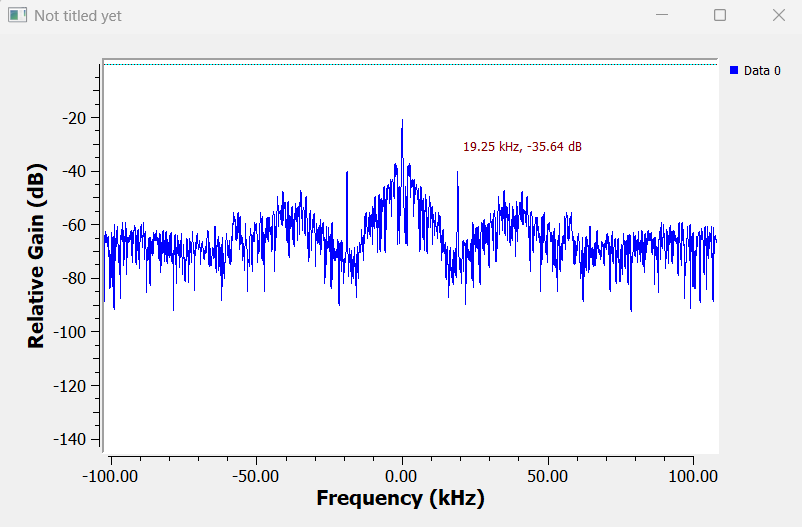
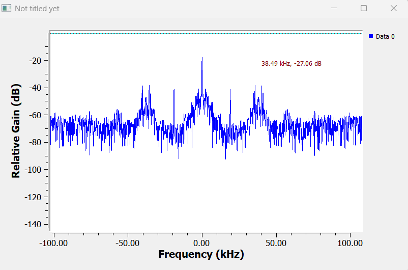
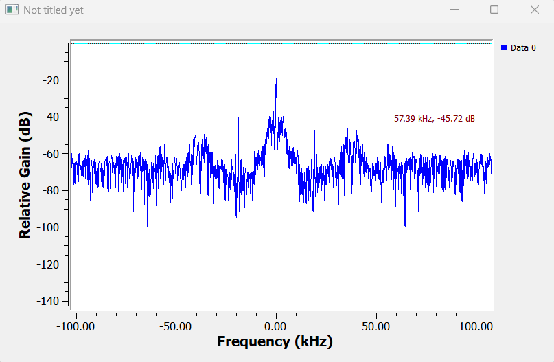

# 6. FM Broadcast Baseband Structure

FM broadcast signals do not contain only audio information. A stereo FM broadcast also contains a pilot tone, stereo difference information, and RDS data.

To observe these components, a QT GUI Frequency Sink was connected after the Quadrature Demod block. This allowed the spectrum of the demodulated FM composite baseband signal to be analyzed.



Since the Frequency Xlating FIR Filter reduced the sampling rate to **400 kHz**, the baseband analysis was performed over a 400 kHz bandwidth.

## 6.1 Mono audio component - L+R (0-15 kHz)

The high-energy region around the center of the spectrum represents the main mono audio component. This signal contains the sum of the left and right audio channels:

```text
L + R
```

Mono FM receivers use only this part of the signal to play the broadcast.



## 6.2 Pilot tone - 19 kHz

A narrow peak around **19 kHz** represents the stereo pilot tone. This tone tells the receiver that the broadcast is stereo.

The pilot tone is also used as a reference for regenerating the 38 kHz subcarrier needed for stereo decoding.



## 6.3 Stereo subcarrier - 38 kHz

The component around **38 kHz** carries the stereo difference information:

```text
L - R
```

At the receiver side, the mono sum signal `(L+R)` and the stereo difference signal `(L-R)` can be combined to reconstruct the left and right audio channels.



## 6.4 RDS subcarrier - 57 kHz

The component around **57 kHz** carries RDS data. In the previous RDS decoding section, this subcarrier was isolated, shifted to baseband, and decoded successfully.

The decoded station name, program type, PI code, and radiotext confirmed that this component was carrying RDS information.



## 6.5 Evaluation

The observed spectrum confirmed the expected FM composite baseband structure:

```text
0-15 kHz   : Mono audio (L+R)
19 kHz     : Stereo pilot tone
38 kHz     : Stereo difference information (L-R)
57 kHz     : RDS data
```

These observations are consistent with the theoretical structure of stereo FM broadcasting and validate the earlier RDS decoding results.
