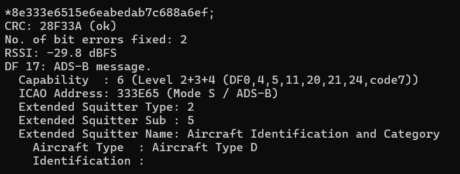
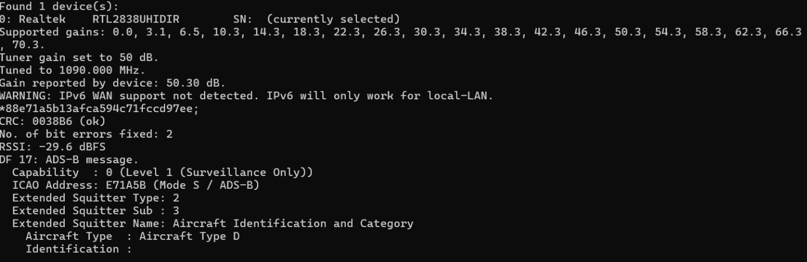
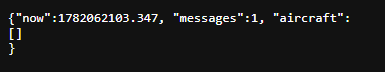
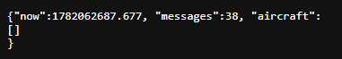
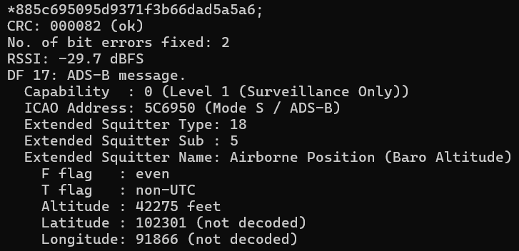
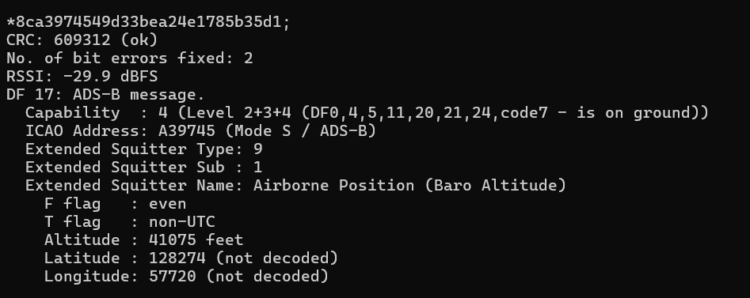
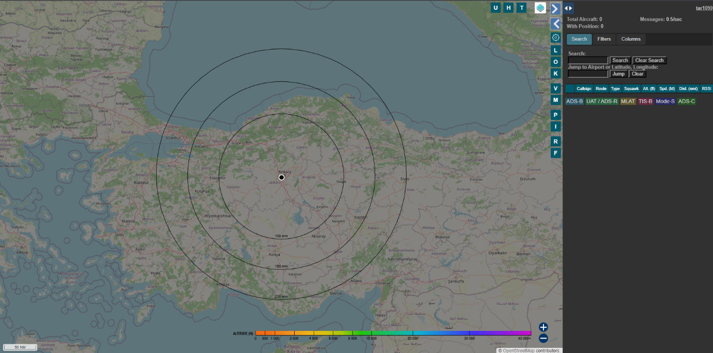

# 7. ADS-B Aircraft Tracking

## 7.1 ADS-B system

**ADS-B (Automatic Dependent Surveillance - Broadcast)** is an aircraft surveillance system in which aircraft broadcast information such as identity, altitude, speed, and position. The most common ADS-B frequency used for reception with RTL-SDR is **1090 MHz**.

In this experiment, the RTL-SDR receiver and Dump1090 software were used to receive and decode ADS-B packets.

The decoded message output includes information such as ICAO address, message type, and other aircraft-related fields.

## 7.2 Receiving aircraft data

The RTL-SDR receiver was tuned to **1090 MHz** and Dump1090 was started. ADS-B packets transmitted by aircraft were received and displayed in the terminal.

Dump1090 also produced JSON files containing the received and processed aircraft message data.

The received message count was also monitored to verify that packets were being received.

## 7.3 Results

Some ADS-B messages were successfully received and partially decoded. The received data included identifiers and altitude-related information.

Tar1090 was also started to display aircraft on a map interface. However, aircraft could not be displayed reliably on the map.

The reason is that complete position information could not be decoded consistently from the received ADS-B packets. Although some packets were received, the data quality was not sufficient for stable map plotting.

The main limitation was most likely the antenna system. The antenna used in this experiment was not optimized for the **1090 MHz ADS-B band**. For reliable ADS-B position decoding, a suitable 1090 MHz antenna and better RF reception conditions are required.

Therefore, the ADS-B part of the project should be evaluated as **partially successful**:

- ADS-B packets were received.
- Some aircraft-related fields were decoded.
- Altitude and identifier-related information was observed.
- Complete position decoding was not reliable enough.
- Aircraft could not be displayed on the Tar1090 map.

This result is still useful because it shows the practical RF limitations of SDR reception and demonstrates why antenna selection is critical in ADS-B applications.
