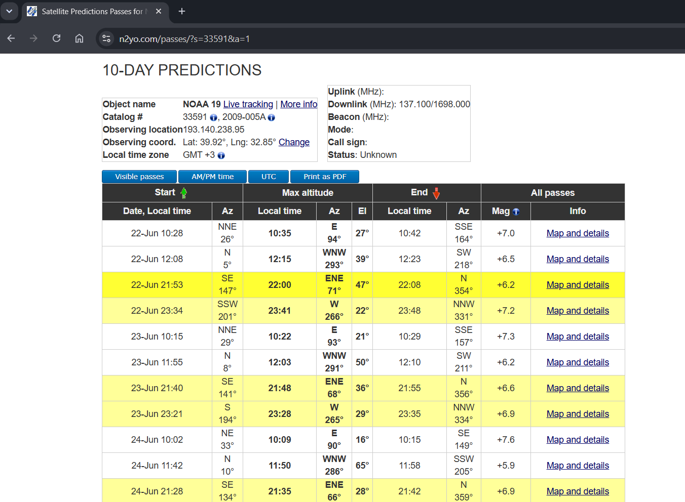
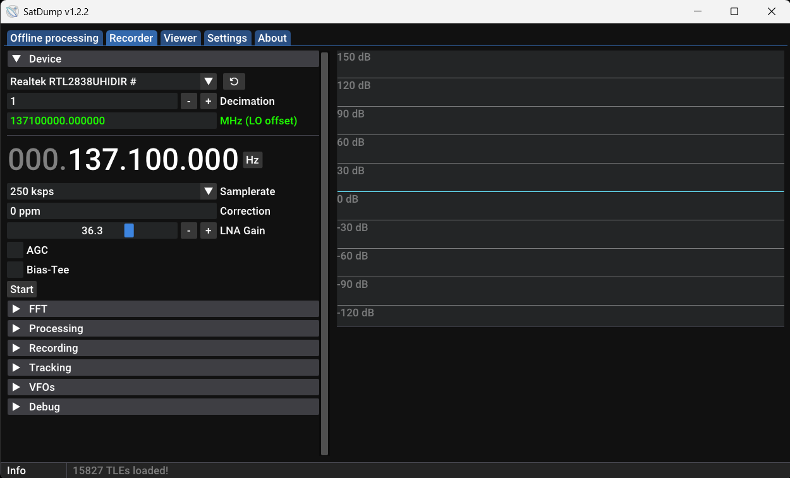
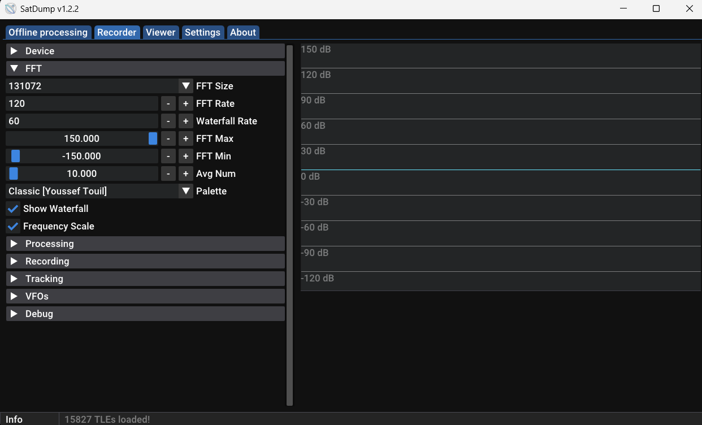
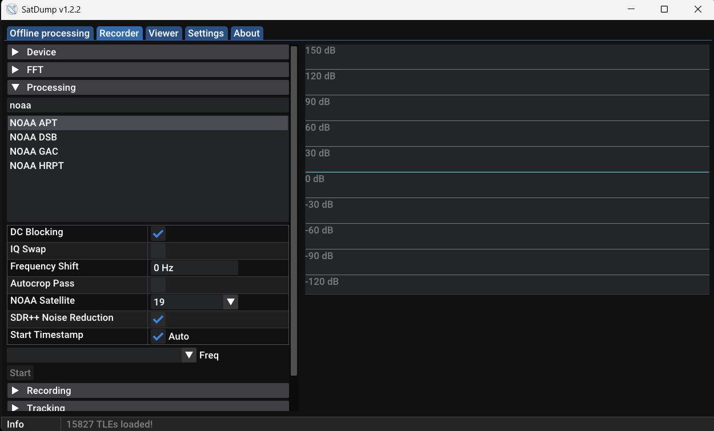
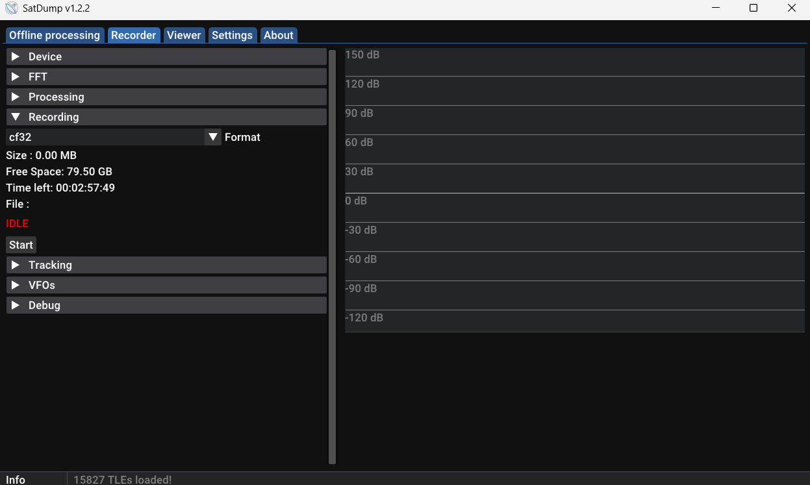
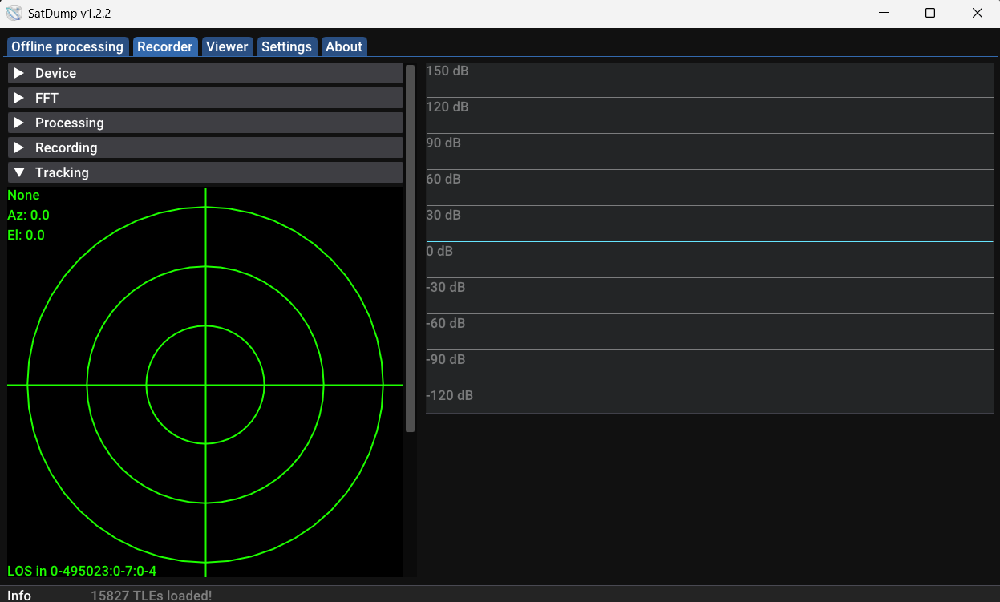
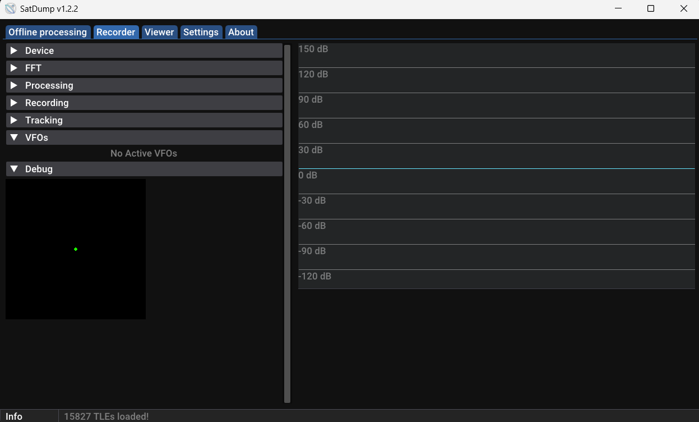

# 8. NOAA Weather Satellite Reception

## 8.1 NOAA system

NOAA weather satellites are low Earth orbit (LEO) satellites used for meteorological observation. Some NOAA satellites transmit **APT (Automatic Picture Transmission)** signals around the **137 MHz** band.

These signals can be received using an SDR receiver and later processed into weather satellite images.



Satellite pass times and orbital information were checked using the N2YO platform. A suitable NOAA-19 pass was selected for the Ankara location.

## 8.2 Satellite signal reception

The RTL-SDR receiver was configured in SatDump. The NOAA-19 downlink frequency was selected as:

```text
137.1 MHz
```

The sample rate was set to:

```text
250 ksps
```



The FFT screen was used to monitor the received signal in the frequency domain. Spectrum and waterfall displays were used to identify the satellite signal during the pass.



The NOAA APT processing pipeline was selected in SatDump. NOAA-19 was selected as the target satellite and noise reduction options were enabled.



For later processing, the raw IQ recording format was selected as **CF32**.



During the satellite pass, azimuth and elevation information were followed using the tracking screen.



The VFO and debug screens were also inspected for signal analysis and troubleshooting.



## 8.3 Image processing status

This section is still in progress. The receiver setup and SatDump workflow were prepared, and the system was configured for NOAA-19 APT reception.

The next step is to process the recorded IQ data using SatDump and convert it into NOAA APT weather images. The final decoded images will be added in a future update.

Current status:

- NOAA-19 pass planning was completed.
- RTL-SDR was configured in SatDump.
- NOAA APT pipeline was selected.
- IQ recording workflow was prepared.
- Final APT image decoding is planned as the next stage.
